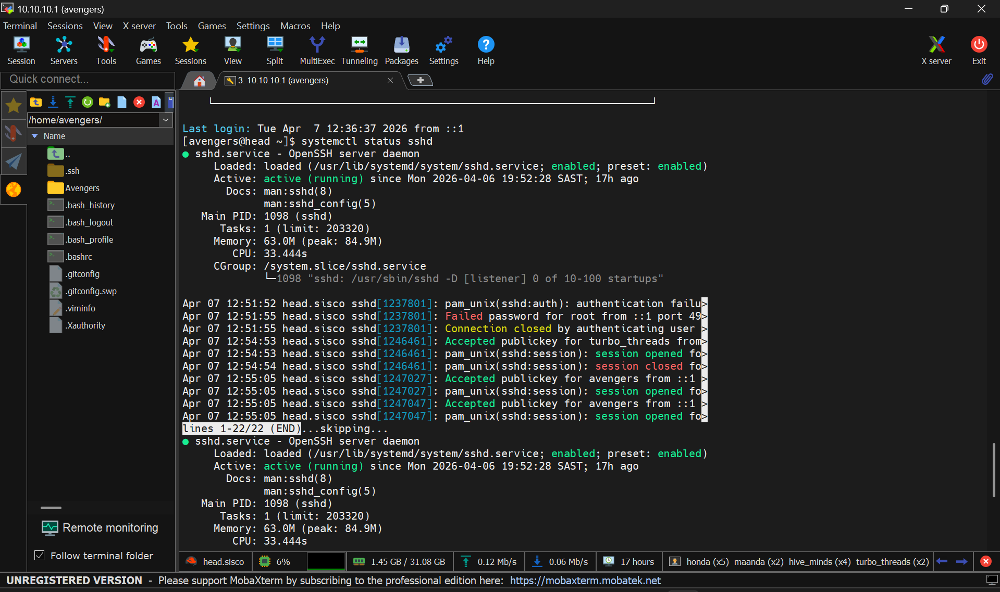
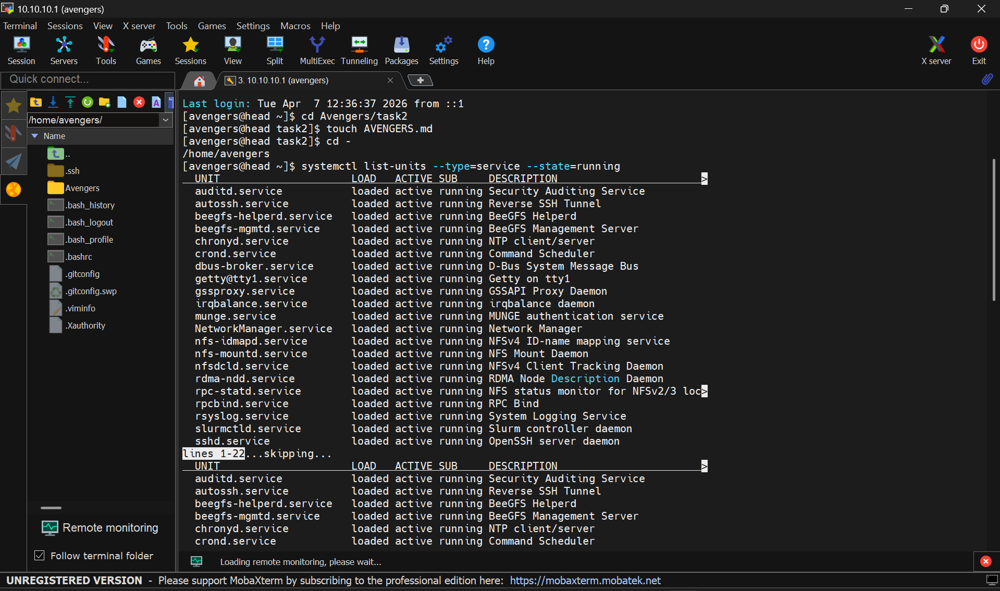
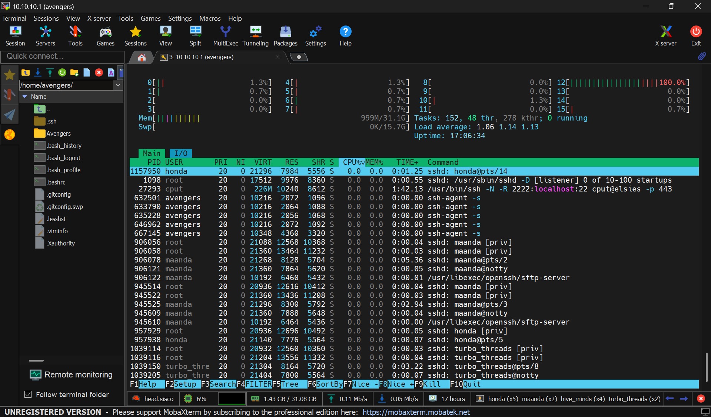
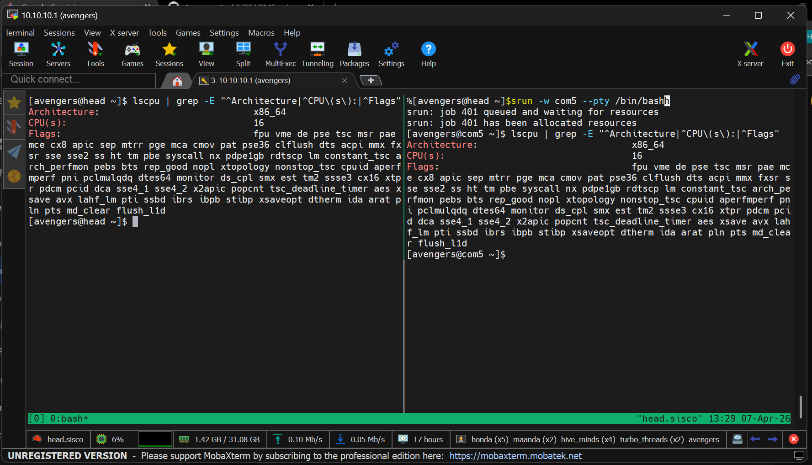
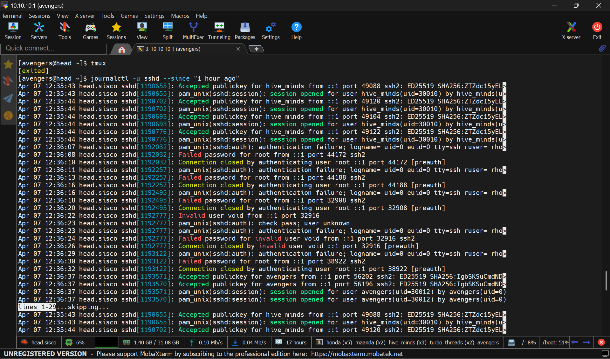

# 1. Get Status Of SSH Service On Head Node

### Run this command to get ssh status: 
`systemctl status sshd`

# 2. List Of All Running Services On Head Node

### Run this command to get services list on head node: 
`systemctl list-units --type=service --state=running`

# 3. Identify SSH Process on Compute Node

### Run this command for htop: 
`htop`
### TIP! (Once in htop, press F4 to filter and type "ssh" to isolate the process)

# 4. CPU Details (Head and Com5) via Tmux

### Steps to reproduce:
1. Run `tmux` to start a new session.
2. Press `Ctrl + B`, release, then press `Shift + 5` (%) to split the screen.
3. Use `sinfo` to check node availability.
   * **idle/mix**: Resources available.
   * **alloc**: 100% full.
4. Run `srun -w com5 --pty /bin/bash` to get an **interactive** job on an available node (used com5 as com2 was allocated).
5. Run the CPU check: `lscpu | grep -E "^Architecture|^CPU\(s\):|^Flags"`
6. Type `exit` in both panes to close the session.

# 5. SSH Logs from the Last Hour on Head Node

### Run this command to view SSH logs:
`journalctl -u sshd --since "1 hour ago"`