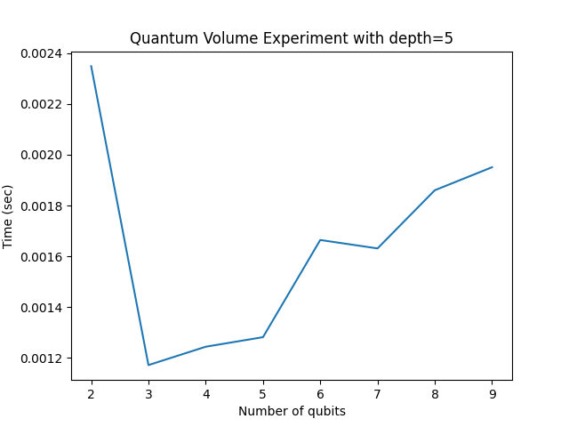
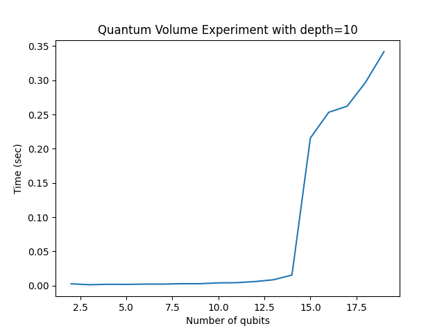
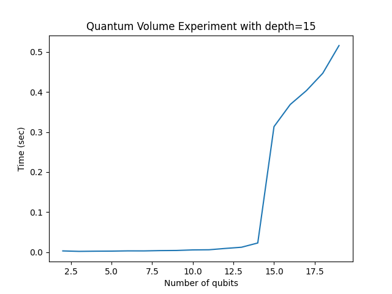
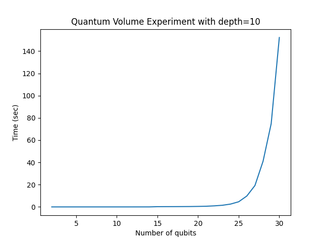
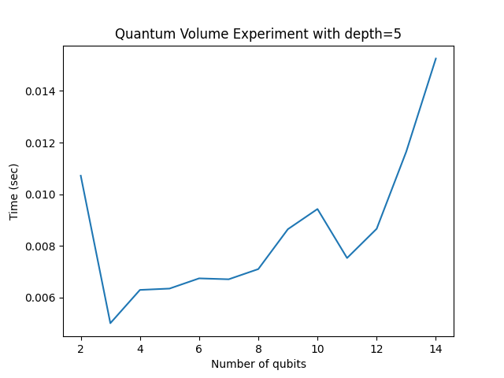
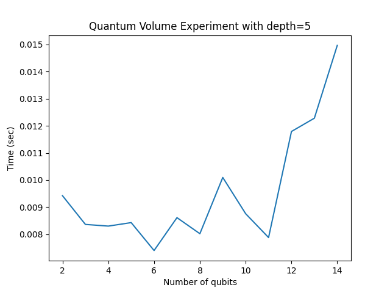

# Task 4 - Quantum Volume Benchmark

## Initial Benchmark
Running the benchmark with `num_qubits=(2,10)`, `qv_depth=5`, `num_shots=10`

## Varying Depth

As depth increases, simulation time increases proportionally. This is because 
depth represents the number of discrete time steps during which the circuit 
runs gates. More depth means more operations per qubit.

| Case 1 - depth=5 | Case 2 - depth=10 | Case 3 - depth=15 |
|---|---|---|
|  |  |  |

## Varying Number of Qubits

As the number of qubits increases, simulation time grows exponentially. 
This is because each additional qubit doubles the state space the simulator 
needs to track.

## Varying Number of Shots

Increasing shots increases simulation time as more repetitions of the 
circuit are run for better sampling statistics.

## Code

See `qv_experiment.py` for the full benchmark script.
